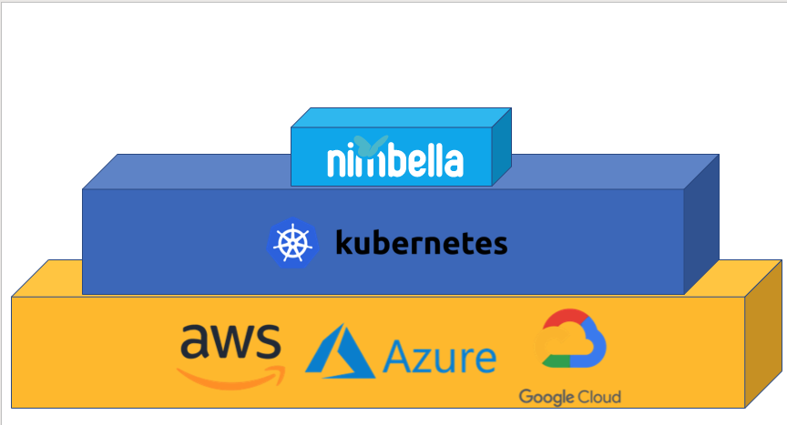
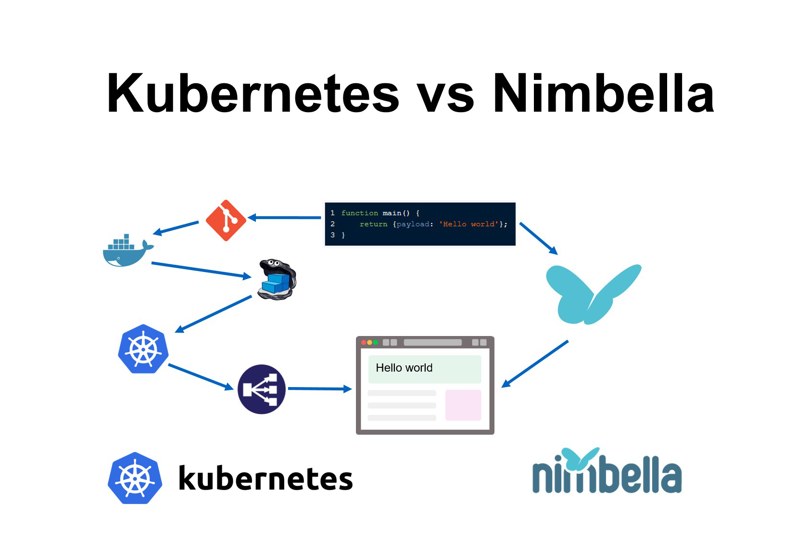
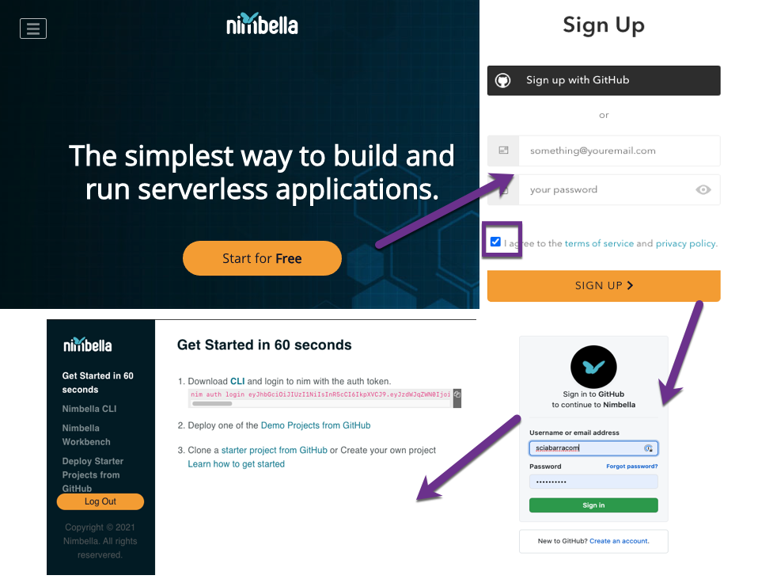
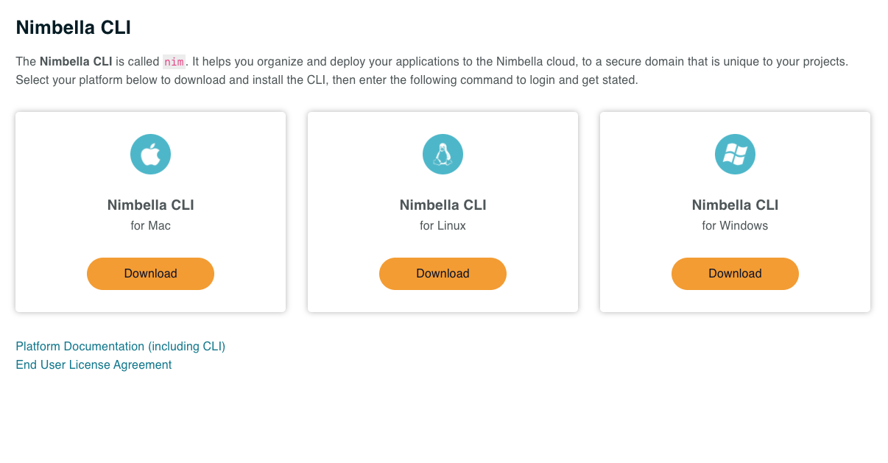
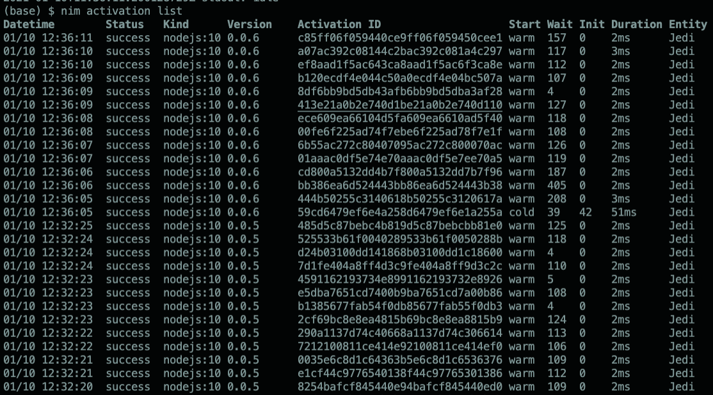
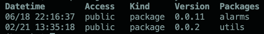
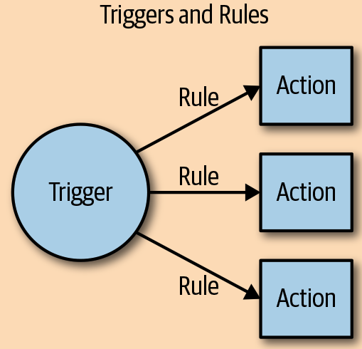

# **Lesson 1**

Jump Start with Nimbella

https://www.nimbella.com

---
# Requirement for Certification

- complete the exercises
  - to be delivered at the end
- complete a final online survey
  - link delivered at the course completion

---
# Plan

- Setup
    - signup with nimbella
    - installing using the `nim` cli
- Actions and Activations
    - creating an action with FAAS Wars
    - checking activation logs and results
- Triggers and Rules
    - a sample using slack
    - timed execution

---
# Nimbella in a nutshell

- Serveless Development Platform
- Cloud-Native made easy
- Microservice architecture
- Awesome developer experience
- Multi-cloud and "in your cloud"

---
# Nimbella vs Kubernetes vs Cloud



---


---


---


---
# Install nim cli



---
# Login

- `nim auth login`
open the browser and log into your github account

- `nim auth current`
show your namespace

- `nim namespace get`
show what you have in the namespace

- `nim namespace clean`
cleaning your namespace

---
# <!--!--> Authentication
```sh
# authentication
nim auth login
nim auth list
nim auth current
nim namespace get
nim namespace clean
```

---


---
# Inspecting Actions

- `nim action list` 
list actions
- `nim action get <name>` 
get informations about an action
- `nim action get <name> --url` 
get the public url of an action

---
# <!--!--> Inspecting the action
```sh
# Inspecting the action
nim action list
nim action get Jedi
nim action get Jedi --url 
```

---
# Action invocation with nim

##  with `action invoke`: 
- `nim action invoke <action-name> <parameters>`

## `<parameters>`:
- `-p <name> <value> ...`
can be repeated multiple times
- `-P <file>.json`
you need a file in json format

---
# <!--!--> Invoking an action with parameters
```sh
# Invoking an action with parameters
nim action invoke Jedi -p event idle
nim action invoke Jedi -p event hit
nim action invoke Jedi -p event enemy-spot
nim action invoke Jedi -p event wall-collide

# invoking an action with json
echo '{ "event": "idle"}' >args.json
nim action invoke Jedi -P args.json
```

---
# Action invocation with `curl` 

## only for web actions!

- `--web true`  
  - web public it is the default with `nim`
  - **not** all the actions are web public

## use url-encoded parameters

- `curl -X GET <url>?event=hit`
- `curl -X POST -d  event=hit <url>`

---
# <!--!--> Using `curl` for web actions
```sh
# Using Curl  for web actions

URL=$(nim action get Jedi --url)
echo $URL

# use GET and url parameters

curl "$URL?event=hit"

## use POST and form data (url-encoded)

curl -X POST -d event=enemy-spot "$URL"
```

---
# Updating an Action

- `nim action update <name> <file>`
   - works also if the action does not exists
   - some people only uses `update`

---
# <!--!--> Simple Action
```js
function main(args) {
    console.log(args.event)
    return { body: [
        {"turn_turret_left": 15, 
         "shoot": true}
    ]}
}
/*
nim action update Jedi jedi.js
nim action invoke Jedi
*/
```

---
# Checking Activations

- `nim activation list [--limit <n>]`
list actions, you can limit them

- `nim activation logs [<id>]`
show logs of an activation

- `nim activation result [<id>]`
show logs of an activation

---
# <!--!--> Activations
```sh
# Activations
nim activation list
nim action invoke Jedi -p event idle
nim activation list --limit 3

nim activation logs
nim activation result
```

---


---


---
# Managing Packages

## package = "collection of actions"

- `nim package create greetings`
create a package

- `nim action create greetings/hello hello.js`
create an action in the package

- `nim action delete greetings -r`
remove package and all its actions

---
# <!--!--> Create package with 2 actions
```sh
# create package with 2 actions
nim package list
nim action list
nim package create greetings
nim action create greetings/hello hello.js
nim action create greetings/hi hi.js
# check and clean
nim package list
nim action list
nim package delete greetings
nim package delete greetings -r
nim package list
nim action list
```

---
# Package variables

- `nim package update <package> -p name Mike`
- available to all actions in package

# Action variables

- `nim action update <action> -p name Mike`
- useful to share configurations
- action variables overrides package variables

---
# <!--!--> Create package without variables
```sh
# create package without variables
nim package create greetings
cat hello.js
nim action create greetings/hello hello.js
cat hi.js
nim action create greetings/hi hi.js

# no variables, default
nim action invoke greetings/hello
nim action invoke greetings/hi
```

---
# <!--!--> Override variables
```sh
# override package variables
nim package update greetings -p name Mike
nim action invoke greetings/hello
nim action invoke greetings/hi

# override action variable
nim action update greetings/hi -p name Michele
nim action invoke greetings/hello
nim action invoke greetings/hi
```

---
# Shared Packages in `whisk-system`

-  you can share your package with others:
`nim action create <package> --shared=yes`

- shared (system) packages:
`nim packages list /whisk-system`



---
# <!--!--> Inspect `whisk-system`
```sh
# inspect whisk-system
nim package list /whisk-system
nim action list /whisk-system/alarms
nim action get /whisk-system/alarms/interval
```

---
# Example: a "slack" notification action

1. Creating a slack URL
1. Passing the URL as package variable
1. Writing messages in the url with an action
1. Profit!

---


---
# <!--!--> Writing in Slack
```sh
# writing in  slack
source $HOME/.ssh/secret.sh
curl -X POST -d '{"text": "Hello"}' $NOTIFICATIONS
curl -X POST -d '{"text": "How are you"}' $NOTIFICATIONS
```

---
# <!--!--> `notify.js`
```js
// notify.js
const axios = require('axios').default;

function main(args) {
    return axios.post(args.notifications, {
        text: args.text
    }).then(r => {
        return {
            "body": r.data
        }
    })
}
```

---
# <!--!--> Notifications
```sh
# notifications
nim package update slack -p notifications $NOTIFICATIONS
nim action update slack/notify notify.js
nim action invoke slack/notify -p text hello
nim action invoke slack/notify -p text hi
```

---


---
# Creating a trigger

- `nim trigger create <name>`
create a trigger with the given `<name>`

- `nim trigger fire <name> <parameters>`
fire a trigger with parameters
  
- `<parameters>`:
  - `-p <name> <value>...`
  - `-P <file>.json`

---
# Creating and enabling rules

- `nim rule create <name> <trigger> <action>`
  - create a rule `<name>` 
  - ...to invoke the `<action>` 
  - ... when firing the `<trigger>`

-  `nim rule enable <name>`
`nim rule disable <name>`
enable or disable rules

---
# <!--!--> `echo.js`
```js
// echo.js
function main(args) {
    console.log(args)
    return args
}
```

---
# <!--!--> Inspecting Trigger Invocation
```sh
# inspecting trigger invocation
nim trigger create echoer
nim action create echo echo.js
nim rule create echoer-echo echoer echo
nim trigger fire echoer -p hello world
nim activation logs
nim activation result
```

---
# <!--!--> `notify2.js`
```js
// notify2.js
// prefixed message, parameters from trigger
const axios = require('axios').default;

function main(args) {
    let prefix = args.prefix || ""
    let text = args.parameters[0].value
    return axios.post(args.notifications, {
        text: prefix + text
    }).then(r => {
        return {
            "body": r.data
        }
    })
}
```

---
# <!--!--> A trigger with 2 actions, first
```sh
# create two actions with different prefixes
nim trigger create slacker
nim action update slack/first notify2.js -p prefix '[first] '
nim rule create slacker-first slacker slack/first
nim rule enable slacker-first
nim trigger fire slacker -p text from-trigger-1
```

---
# <!--!--> A trigger with 2 actions, second
```sh
nim action update slack/second notify2.js -p prefix '[second] '
nim rule create slacker-second slacker slack/second
nim rule enable slacker-second
nim trigger fire slacker -p text from-trigger-2
nim rule disable slacker-first
nim trigger fire slacker -p text from-trigger-3
```

---
# Feed
- a feed is a sorce of events for a trigger
  - it will fire when an event occurs

## Alarms

- predefined Nimbella feed 
- generate periodically trigger invocations

- `nim trigger create every-minute \` 
`--feed /whisk-system/alarms/interval -p minutes 1`

---
# <!--!--> Checking parameters
```sh
# Inspecting packages
nim package list /whisk-system/
nim action list /whisk-system/alarms
nim action get /whisk-system/alarms/interval
```

---
# <!--!--> `tick.js`
```js
// tick.js
const axios = require('axios').default;

function main(args) {
    let text = new Date().toISOString()
    return axios.post(args.notifications, {
        text: text
    }).then(r => {
        return {
            "body": r.data
        }
    })
}
```

---
# <!--!--> Enable Ticker
```sh
# enable ticker
nim trigger create ticker --feed /whisk-system/alarms/interval -p minutes 1
nim action update slack/tick tick.js
nim rule create ticker-tick ticker slack/tick
nim rule enable ticker-tick
```

---
# Exercise for certification

- create a web site monitor
  - checks if a site is up and running
  - notifies in slack if something is wrong
  - it is executed every minute
