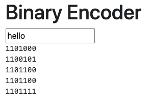

# **Lesson 2**

A simple CRUD application

https://www.nimbella.com

---
# Plan

- create a nimbella project
  - use jquery and bootstrap
  - sample: "secret" message encoder
- web project with framework
  - use redis for storage
  - use svelte for front-end
  - sample: a "crud" application

---
# A Nimbella project
- Collection of
  - actions (backend)
  - web assets (front-end)
  - redis (storage)
  - bucket (uploads)
  - more... 
- Managed with `nim`

---
# Conventions over configurations

- Actions are in `packages` folder
  - Subfolders are packages
  - Use "default" for "no package" actions
- A single file with extension determine the actions
  - It can also be a directory
- Deploy with `nim project deploy <project-dir>`

---
# Example: 'secret' message encoder



Translate a "plain text message" in binary numbers.

- backend action 
  - encode the messages 
- front end action
  - render the message
- uses jquery for ajax and bindings

---
# <!--!--> Convert text in binary string 
```js
// Convert text in binary string 
function main(args) {
    let text = args.text || ""
    let res =  text.split("").map(
      function (x) {
        return x.charCodeAt(0).toString(2)
      }
    )
    return { 
        "body": res.join("\n")
    }
}
```

---
# Testing locally

- Recommended practice before publishing
- With node.js:
    - start `node`
    - `eval(require("fs").readFileSync(<file>, 'utf-8'))`
    - invoke `main(<args>)`

- Recommended: write "unit tests"
  - for example with `jest`

---
# <!--!--> Testing locally the binary action
```sh
# testing locally the binary action
node
eval(require("fs").readFileSync("encoder/packages/default/binary.js", 'utf-8'))
main({"text":"hello"})
main({})
```

---
# <!--!--> Deploy encoder
```sh
# deploy encoder
mkdir -p encoder/packages/default
cp src/binary.js encoder/packages/default
nim project deploy encoder
nim action invoke binary -p text hello
```

---
# Web Content

- placed under `<project>/web`
- uploaded when deploying
- actions accessible with `/api` prefix

---
# <!--!--> Encoder User Interface
```html
<!DOCTYPE html>
<html>
<head>
    <link rel="stylesheet" href="https://stackpath.bootstrapcdn.com/bootstrap/4.3.1/css/bootstrap.min.css">
    <script src="https://code.jquery.com/jquery-3.3.1.min.js" ></script>
</head>
<body>
  <div class="container">
    <h1>Binary Encoder</h1>
    <input type="text" id="input">
    <pre id="output"></pre>
  </div>
  <script src="index.js" ></script>
</body>
</html>
```

---
# <!--!--> Encoder Logic
```js
$("#input").keyup(function () {
    $.post("/api/default/binary", 
      {
        text: $("#input").val()
      }, 
      function(data) {
        $("#output").text(data)
      }
    )
})
```

---
# <!--!--> Deploy web content
```sh
# deploy web content
find encoder
mkdir -p encoder/web
cp src/index.html encoder/web
cp src/index.js encoder/web
nim project deploy encoder
```

---
# Local Development

## Common Problems:
- Not everything works without a web server
- CORS! Requests require same origin

## Solution:
- use a local web server and setup a proxy to Nimbella API
`http-server encoder/web 
--proxy https://$(nim auth current)-apigcp.nimbella.io`

---
# <!--!--> Install and run local server
```sh
# install and run local server
npm install -g http-server
http-server encoder/web --proxy https://$(nim auth current)-apigcp.nimbella.io
# in another terminal
vi encoder/web/index.html
```

---
# Options for `project deploy` 

- use `--incremental` to deploy only changes
- use `--exclude=<path>` to exclude directories (or files)

```
nim project deploy --incremental encoder
nim project deploy --exclude=web encoder
```

---
# <!--!--> Examples of incremental update
```sh
## examples of incremental update
# edit frontend
vi encoder/web/index.html
# deploy only changed files
nim project deploy encoder --incremental
# edit backend
vi encoder/packages/default/binary.js
# deploy excluding web folder
nim project deploy encoder --exclude=web
```

---
# Using Redis

- A "in-memory" key-value store
- Data is persisted on disk and backed up
  - can be used as data store
- Very fast 
  - can be also used as cache
- Works as shared state
  - multiple actions can read and write

---
# <!--!--> Set in Redis (v1)
```js
// set.js v1
function main(args) {
    let db = require("@nimbella/sdk").redis()
    let key = args.key
    let value = args.value
    return db.setAsync(key, value)
    .then(reply => { return {"body": reply}})
    .catch(err =>  { return {"body": err}})
}
```

---
# <!--!--> Get in Redis (v1)
```js
// get.js v1
function main(args) {
    let db = require("@nimbella/sdk").redis()
    let key = args.key
    return db.getAsync(key)
    .then(reply => { return {"body": reply } })
    .catch(err =>  { return {"body": err}})
}
```

---
# <!--!--> Setup address project
```sh
# setup address project
mkdir -p address/packages/addr
cp src/set1.js address/packages/addr/set.js
cp src/get1.js address/packages/addr/get.js
nim auth current
nim project deploy address
```

---
# <!--!--> Testing get/set
```sh
# testing get/set
## set then get
nim action invoke addr/set -p key hello -p value world
nim action invoke addr/get -p key hello
nim action invoke addr/get -p key hi
# change value
nim action invoke addr/set -p key hello -p value earth
nim action invoke addr/get -p key hello
```

---
# <!--!--> Using `nim kv`
```sh
# nim kv support
nim kv
nim kv list
nim kv get hello
nim kv clean
nim kv list
```

---
# Write a record

- `set.js` v2 diff:
```
<     let key = args.key
<     let value = args.value
===   
>     let key = "address:"+args.name
>     let value = JSON.stringify({
>             "name": args.name || "",
>             "company":  args.company  || "",
>             "phone": args.phone || ""
>     })
```

---
# Read a record

- `get.js` v2 diff:
```
3c3
<     let key = args.key
===
>     let key = "address:"+args.name
5c5
<     .then(reply => { return {"body": reply } })
===
>     .then(reply => { return JSON.parse(reply || "")})
```

---
# <!--!--> `del.js`
```js
// del.js
function main(args) {
    let db = require("nim").redis()
    let key = "address:"+args.name
    return db.delAsync(key)
    .then(reply => { return {"body": reply}})
    .catch(err =>  { return {"body": err}})
}
```

---
# <!--!--> Deploy record actions
```sh
# Deploy fixed actions
cp src/set2.js address/packages/addr/set.js
cp src/get2.js address/packages/addr/get.js
cp src/del.js address/packages/addr/del.js
find address
nim project deploy address
```

---
# <!--!--> Test record actions
```sh
# Test the actions
nim action invoke addr/set -p name Michele -p company Nimbella -p phone 392 
nim action invoke addr/get -p name Michele
nim action invoke addr/del -p name Michele
nim action invoke addr/get -p name Michele
```

---
# <!--!--> List all records
```js
// loading all the records
function main() {
    let db = require("@nimbella/sdk").redis()
    return db.keysAsync("address:*")
    .then(reply => {
        return reply.length == 0 ? []
          : db.mgetAsync(reply)
        })
    .then(reply => {
        return { 
        "body": reply.map(JSON.parse) 
       }
    })
    .catch(err => { return { "body": err}})
}
```

---
# Dissecting `all.js`:

- `db.keysAsync("address:*").then(reply => ...)`:
reply= `[ 'address:Mirella', 'address:Michele' ]`

- ` db.mgetAsync(reply).then(reply => ... )`:
reply = `[ '{"name":"Mirella","company":"Sciabarra","phone":328}',
'{"name":"Michele","company":"Nimbella","phone":392}' ]`

- `reply.map(['{}', '{"a":1}])` 
= `[{},{"a":1}]`

---
# <!--!--> Deploy and test `all.js`
```sh
# add all
cp src/all.js address/packages/addr/all.js
nim project deploy address
nim action invoke addr/all
nim action invoke addr/set -p name Michele -p company Nimbella -p phone 392 
nim action invoke addr/set -p name Mirella -p company Sciabarra -p phone 328 
nim action invoke addr/all
curl $(nim action get addr/all --url)
```

---


---
# Create a svelte app

- `npx degit sveltejs/template web`
uses a template
- requires some configuration:
  - `project.yml`
  - `web/.include`

---
# <!--!--> Deploy Web Content
```sh
cd address
rm -Rvf web
npx degit sveltejs/template web
echo "public" >web/.include
echo -e "bucket:\n  strip: 1" >project.yml
cd ..
nim project deploy address
```

---
# How to use a subfolder

- `project.yml` (strip one level):
```
bucket:
  strip: 1
```

- `web/.include` (pick the subfolder `public`):
```
public
```

---
# Svelte is "reactive"
- declare: `let data = ""`
- use: `{data}`
- assign: `data = "hello"` 
  - triggers view update
- `onMount` executed when view ready

---
# <!--!--> Load All data
```sh
<script>
  // retrieve data
  let data = []
  function all()  {
      fetch("/api/addr/all")
      .then(r => r.json())
      .then(d => data = d)
  }
  // init
  import { onMount } from 'svelte'
  onMount(all)
</script>

<pre>{JSON.stringify(data, null, " ")}</pre>
```

---
# <!--!--> Deploy and Test v1
```sh
# deploy and test
cp src/App1.svelte address/web/src/App.svelte
nim project deploy address
# show
nim action invoke addr/set -p name Max -p company Gear -p phone 333 
```

---
# Svelte templates
  - reactive
    - just update variable
  - `{#each data as row}`
    - iterates array assigning to row
  - `{row.name}`
    - render value
  - `{/each}`
    - closes block

---
# <!--!--> Adding the table
```html
<table>
  <tr>
    <th>Name</th>
    <th>Company</th>
    <th>Phone</th>
  </tr>
  {#each data as row}
      <tr>
        <td>{row.name}</td>
        <td><tt>{row.company}</tt></td>
        <td><i>{row.phone}</i></td>
      </tr>
  {/each}
</table>
```

---
# <!--!--> Deploy v2
```sh
cp src/App2.svelte address/web/src/App.svelte
nim project deploy address
```

---
# <!--!--> Form
```js
let form = {}
function add() {
    fetch("/api/addr/set", 
    {
        method: 'POST',
        headers: { 'Content-Type': 'application/json' },
        body: JSON.stringify(form)
    })
    .then(all)
    .then(() => { form = {}})
}
```

---
# Svelte Bindings
 - `<input bind:value={form.name}>`
   - value stored into `form.name`

# Svelte events

 - `<button on:click={add}>Add</button>`
   - event `click` execute function `add`
  

---
# <!--!--> Form HTML
```html
<form>
  <input placeholder="Name" 
   bind:value={form.name}>
  <br>
  <input placeholder="Company" 
   bind:value={form.company}>
  <br>
  <input placeholder="Phone" 
   bind:value={form.phone}>
  <br>
</form>
<button on:click={add}>Add</button>
```

---
# <!--!--> Deploy v3
```sh
# deploy v3
cp src/App3.svelte address/web/src/App.svelte
nim project deploy address
```

---
# <!--!--> Remove
```sh
let select
function remove() {
  fetch("/api/addr/del?name="+select)
  .then(all)
}
```

---
# Remove Changes
```html
 <table>
    <tr>
+     <th></th
      <th>Name</th>
...
      <tr>
+       <td>
+         <input type="radio" 
+          bind:group={select} 
+          value={row.name} />
+       </td>
        <td>{row.name}</td>
...
  <button on:click={add}>Add</button>
+ <button on:click={remove}>Remove</button>
```

---
# <!--!--> Deploy v4
```sh
# deploy v4
cp src/App4.svelte address/web/src/App.svelte
nim project deploy address
```

---
# Exercise for Certification

Implement the "edit" button.

The goal is to load in the form the selected value, allowing to edit it (change and save).


