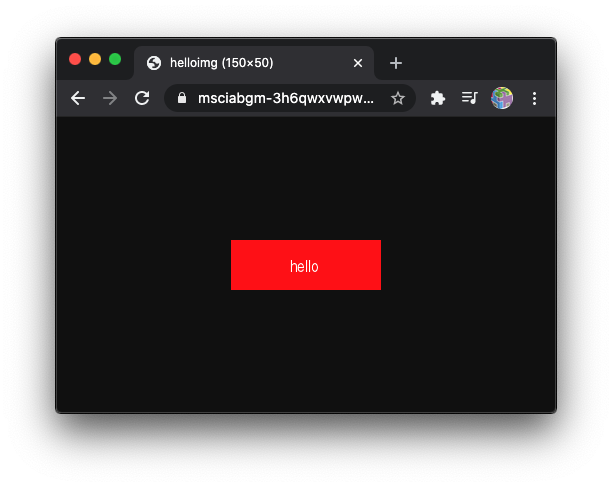
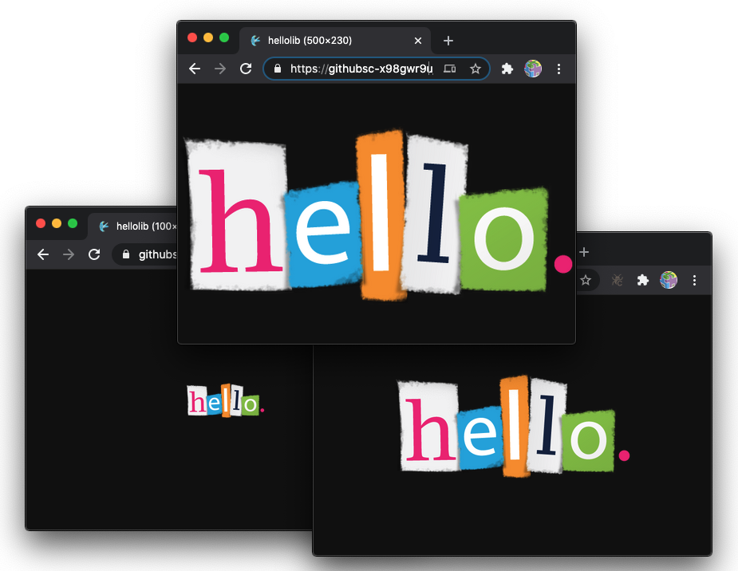

# **Lesson 3**

Advanced Web Applications

https://www.nimbella.com

---
# Plan

- Demo: a photo album
- Web Actions
- Libraries
- Buckets

---
# Step by step

1. Display an image

2. Display the thumbnail of an image

1. An action to upload a file

2. Front-End to do File Upload

3. Generating Thumbnails

4. Rendering Thumbnails

---
# Different kind of actions

- `--web=false`
  no web access at all

- `-web=true`
  web access, cooked

- `--web=raw`
  access, raw

---
# Actions with `--web=false`
- no url for web access without authentication
- input and output in json
- can be used:
  - in sequences
  - with triggers
  - invoked with API
    - requires API KEY, `POST` and `Content-Type: application/json`

```
23bc46b1-71f6-4ed5-8c54-816aa4f8c502:123zO3xZCLrMN6v2BKK1dXYFpXlPkccOFqm12CdAsMgRU4VrNZ9lyGVCGuMDGIwP
```

---
# `hello.js`:
```
function main(args) {
    let name = args.name || "World"
    console.log(args)
    return {
        "hello": name
    }
}
```

---
# <!--!--> Test `hello.js` with `--web=false`
```sh
# Exploring `--web=false`
nim action update hello src/hello.js --web=false
nim action get hello --url
URL=$(nim action get hello --url)
curl $URL
AUTH=$(nim auth current --auth)
# invoking action 
curl -X POST -u $AUTH "$URL?blocking=true"
# API invocation showing result
curl -X POST -u $AUTH "$URL?blocking=true" | jq .response.result
# complete invocation with args!!!
curl -X POST -H "Content-Type: application/json" -d '{"name": "Mike"}' -u $AUTH "$URL?blocking=true" | jq .response.result
```

---
# Web Actions (with `--web=true`)

- Input: 
  - parse url with GET 
  - parse inputs in args
- Output:
  - requires `body`
  - optional `headers`
  - optional `statusCode`

---
# <!--!--> `helloweb.js`:

```js
function main(args) {
    let name = args.name || "World"
    console.log(args)
    return {
        "body": "<h1>Hello, "+name+"</h1>\n"
    }
}
```

---
# <!--!--> Test `helloweb.js` with `--web=true`
```sh
# Test `helloweb.js` with `--web=true`
nim action update helloweb src/helloweb.js --web=true
nim action get helloweb --url 
URL=$(nim action get helloweb --url)
curl $URL
# GET url-encoded parameters
curl "$URL?name=Mike"
# POST JSON parameters
curl -X POST -d '{"name": "Mike"}' -H 'Content-type: application/json' $URL
```

---
# <!--!--> <!-- fit --> image content-type


```js
const img = "<base64 ecoded image>"

function main(args) {
    return {
        "body": img,
        "headers": {
            "Content-Type": "image/png"
        }
    }
}
```
## <!--fit--> base64 encoded body!

---
# <!--!--> Test image rendering
```sh
# test image
nim action update helloimg src/helloimg.js --web=true
nim action get helloimg --url
# open in the browser
```

---
# Additional features

- You can use http verbs: 
`GET`, `POST`, `PUT`, `PATCH`, `DELETE`, `HEAD`, `OPTIONS`
- You can use extensions to set the content type:
`.json`, `.html`, `.svg`, `.text` or `.http` (default) 

- Forms with content type `application/x-www-form-urlencoded` are decoded
  - but **NOT** `multipart/form-data`

---
# Additional web informations 

- `__ow_method` (**string**): the HTTP method of the request.
- `__ow_headers` (**map string to string**): the request headers.
- `__ow_path` (**string**): the unmatched path of the request (matching stops after consuming the action extension).
- `__ow_user` (**string**): the namespace

---
# <!--!--> Inspecting with `echo.js`
```sh
ECHO='function main(args) { return { "body": args } }'
nim action update echo <(echo $ECHO) --kind nodejs:default --web=true
URL=$(nim action get echo --url)
curl $URL
# get with args
curl "$URL?a=1&b=2"
# post with form data
FORM='Content-Type: application/x-www-form-urlencoded'
curl -H "$FORM" -X POST -d 'a=1&b=2' $URL
# PUT with json and extra path
JSON='Content-Type: application/json'
curl -H "$JSON" -X PUT -d '{"a":1,"b":2}' $URL/extra/path
```

---

# Using `--web=raw`

If you want to parse your content, use `--web=raw`
You get:

- `__ow_body` (**string**): the request body entity, as a base64 encoded string when content is binary or JSON object/array, or plain string otherwise.
- `__ow_query` (**string**): the query parameters from the request as an unparsed string.

---
# <!--!--> <!--fit --> Inspecting with `echo.js` and `--web=raw`
```sh
# --web=raw
nim action update echo <(echo $ECHO) --kind nodejs:default --web=raw
URL=$(nim action get echo --url)
# get with args
curl "$URL?a=1&=2"
# post with form data
FORM='Content-Type: application/x-www-form-urlencoded'
curl -H "$FORM" -X POST -d 'a=1&b=2' $URL
# PUT with json and extra path
JSON='Content-Type: application/json'
curl -H "$JSON" -X PUT -d '{"a":1,"b":2}' $URL/extra/path
```

---
# Multifile actions

- create a directory instead of a single file
  under `<project>/packages/<package>/<actiondir>`
- use a `index.js` to identify main in javascript
  - do not mix with other languages...
- use `.include` to select included subdirectories
- **or** use `.ignore` to exclude subdirectories


---
# Rendering an image <!--fit-->


- filename:


```js
const fs = require("fs")
let file = path.join(__dirname, "hello.png")
```
- file in base64:
```js
let body = fs.readFileSync(file)
body.toString("base64")
```

---
# <!--!--> `hellodir.js`:
```js
const fs = require("fs")
const path = require('path')

function main(args) {
    let file = path.join(__dirname, "hello.png")
    let body = fs.readFileSync(file)
    return {
        "body": body.toString("base64"),
        "headers": {
            "Content-Type": "image/png"
        }
    }
}
exports.main = main 
```

---
# Test multifile action 
```sh
# Test including a library 
mkdir -p sample/packages/default/hellodir
cp src/hellodir.js sample/packages/default/hellodir/index.js
cp src/hello2.png sample/packages/default/hellodir/hello.png
nim project deploy sample
nim action get  hellodir --url
# open browser
```

---

# Example:
## Resizing


---
# Resizing an image with `sharp`

- `const sharp = require("sharp")`
- `body` is a buffer with an image

```js
sharp(body)
.resize({ width: width })
.toBuffer()
.then(data => ...)
````

- `data` is a buffer with resized image

---
## <!--!--> Resizing an image
```js
const fs = require("fs")
const path = require('path')
const sharp = require("sharp")
function main(args) {
    let file = path.join(__dirname, "hello.png")
    let body = fs.readFileSync(file)
    let width = parseInt(args.width) || 200
    return sharp(body)
        .resize({ width: width }).toBuffer()
        .then(data => { return {
                "body": data.toString("base64"),
                "headers": {  "Content-Type": "image/png" }
        }})
}
exports.main = main 
```

---
# Using `node_modules` libraries in actions

- create in a folder a package.json
`npm init -y`
- install a library, saving the requirement
`npm install --save sharp`
  - `sharp` is the library for image resizing
- for certain libraries, you need to specify the architecture and platform: 
  - `npm install --save --arch=x64 --platform=linux`

---
# <!--!--> Use a library
```sh
# Test including a library 
mkdir -p sample/packages/default/hellolib
cp src/hellolib.js sample/packages/default/hellolib/index.js
cp src/hello2.png sample/packages/default/hellolib/hello.png
cd sample/packages/default/hellolib/
npm -y init
npm install --save --arch=x64 --platform=linux sharp
ls -l
cd -
nim project deploy sample
nim action get  hellolib --url
# open browser
```
 
---
# File Upload

- using `multipart/form-data`: 
  - hits easily the 10mb limit
  - you have to parse the upload
  - not recommended

- Modern practices:
  - use signed urls
  - write to a bucket
  - use File API
  
---
.include upload.js

---
 # <!--!--> Testing Upload
```sh
nim action update upload src/upload.js
nim action invoke upload
nim activation logs
URL=$(curn)
```

---
```sh
cp src/upload.js sample/packages/default/upload.js
nim project deploy sample --incremental
URL=$(nim action get upload --url)
PUT=$(curl $URL)
echo $PUT
nim object delete upload.png
nim object list
curl  -v -X PUT  -H 'Content-Type: image/png' --data-binary @src/sample1.png $PUT
nim object list
nim object get -s upload.png .
```

---
```sh
cp src/download.js sample/packages/default/download.js
mkdir -p sample/web
cp src/favicon.ico sample/web/favicon.ico
cp src/index1.html sample/web/index1.html
nim project deploy sample --incremental
URL=$(nim action get download --url)
curl -v $URL 2>&1 | grep location
echo $URL
nim activation logs
nim activation list --limit 3
```

---
cp src/index2.html sample/web/index.html
cp src/index.js sample/web/index.js
nim project deploy sample


