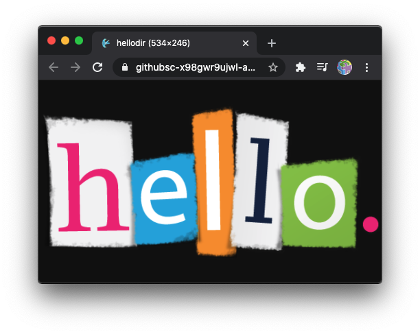
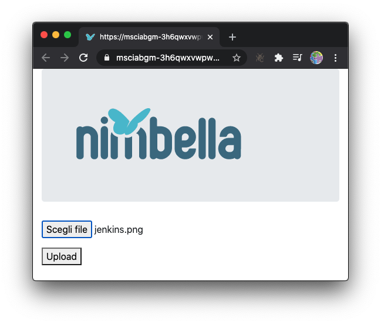

# **Lesson 3**

Web Actions

https://www.nimbella.com

---
# Plan
- Web Actions
  - `true`, `false` and `raw`
  - handling headers and content
- Multi file actions
  - including resources and libraries
- File Upload
  - using buckets

---
# Different kind of actions

- `--web=false`
no web access at all

- `-web=true`
web access, cooked (parsed)

- `--web=raw`
web access, raw (unparsed)

---
# Actions with `--web=false`
- no url for web access without authentication
- input and output in JSON
- private actions can be used:
  - in sequences
  - with triggers
  - using the API KEY


---
# API Invocation

- Path, relative to the `<apihost>`:
`/api/v1/namespaces/<namespaces>/actions/[<package>/]<action>`
- Method: `POST`, with JSON data 
- Header: `Content-Type: application/json`
- Query: `?blocking=[true|false]`
 - API KEY for authentication. Example:
```sh
23bc46b1-71f6-4ed5-8c54-816aa4f8c502:123zO3xZCLrMN6v2BKK1dXYFpXlPkccOFqm12CdAsMgRU4VrNZ9lyGVCGuMDGIwP
```
 
---
# `hello.js`:
```js
// hello.js
function main(args) {
    let name = args.name || "World"
    console.log(args)
    return {
        "hello": name
    }
}
```

---
# <!--!--> Test `hello.js` with `--web=false`
```sh
# Exploring `--web=false`
nim action update hello src/hello.js --web=false
nim action get hello --url
# unauthorized access
URL=$(nim action get hello --url)
curl $URL
# invoking action 
AUTH=$(nim auth current --auth)
# not shown
curl -X POST -u $AUTH "$URL?blocking=true" | jq .
# API invocation showing result
curl -X POST -u $AUTH "$URL?blocking=true" | jq .response.result
# complete invocation with args!!!
curl -X POST -H "Content-Type: application/json" -d '{"name": "Mike"}' -u $AUTH "$URL?blocking=true" | jq .response.result
```

---
# Web Actions (with `--web=true`)

- Input: 
  - parse url with GET 
  - parse inputs in args
- Output:
  - mandatory: `body` for the output
  - optional `headers`
  - optional `statusCode`

---
# Web Action Features

- You can use http verbs: 
`GET`, `POST`, `PUT`, `PATCH`, `DELETE`, `HEAD`, `OPTIONS`
- You can use extensions to set the content type:
`.json`, `.html`, `.svg`, `.text` or `.http` (default) 

- Forms with content type `application/x-www-form-urlencoded` are decoded
  - but **NOT** `multipart/form-data`

---
# <!--!--> `helloweb.js`:


```js
function main(args) {
    let name = args.name || "World"
    console.log(args)
    return {
        "body": "<h1>Hello, "+name+"</h1>\n"
    }
}
```

---
# <!--!--> Test `helloweb.js` with `--web=true`
```sh
# Test `helloweb.js` with `--web=true`
nim action update helloweb src/helloweb.js --web=true
nim action get helloweb --url 
URL=$(nim action get helloweb --url)
curl $URL
# GET url-encoded parameters
curl "$URL?name=Mike"
# POST url-encoded parameters
curl -X POST -d "name=Mike" -H "Content-Type: application/x-www-form-urlencoded"  "$URL"
# PUT with JSON parameters
curl -X PUT -d '{"name": "Mike"}' -H 'Content-type: application/json' $URL
```

---
# <!--!--> <!-- fit --> image content-type


```js
const img = "<base64 encoded image>"

function main(args) {
    return {
        "body": img,
        "headers": {
            "Content-Type": "image/png"
        }
    }
}
```
## <!--fit--> base64 encoded body!

---
# <!--!--> Test image rendering
```sh
# test image
nim action update helloimg src/helloimg.js --web=true
nim action get helloimg --url
# open in the browser

```

---
# Additional web informations

- `__ow_method` (**string**): the HTTP method of the request.
- `__ow_headers` (**map string to string**): the request headers.
- `__ow_path` (**string**): the unmatched path of the request (matching stops after consuming the action extension).
- `__ow_user` (**string**): the namespace.

---
# <!--!--> Inspecting with `echo.js`
```sh
ECHO='function main(args) { return { "body": args } }'
echo $ECHO
nim action update echo <(echo $ECHO) --kind nodejs:default --web=true
URL=$(nim action get echo --url)
curl $URL
# get with args
curl "$URL?a=1&b=2"
# post with form data
FORM='Content-Type: application/x-www-form-urlencoded'
curl -H "$FORM" -X POST -d 'a=1&b=2' $URL
# PUT with json and extra path
JSON='Content-Type: application/json'
curl -H "$JSON" -X PUT -d '{"a":1,"b":2}' $URL/extra/path
```

---
# Using `--web=raw`

If you want to parse your content, use `--web=raw`

You get:

- `__ow_body` (**string**): the request body entity, as a base64 encoded string when content is binary or JSON object/array, or plain string otherwise.
- `__ow_query` (**string**): the query parameters from the request as an unparsed string.

---
# <!--!--> <!--fit --> Inspecting with `echo.js` and `--web=raw`
```sh
# --web=raw
nim action update echo <(echo $ECHO) --kind nodejs:default --web=raw
URL=$(nim action get echo --url)
# get with args
curl "$URL?a=1&=2"
# post with form data
FORM='Content-Type: application/x-www-form-urlencoded'
curl -H "$FORM" -X POST -d 'a=1&b=2' $URL
# PUT with json and extra path
JSON='Content-Type: application/json'
curl -H "$JSON" -X PUT -d '{"a":1,"b":2}' $URL/extra/path
```

---
# Multifile actions

- create a directory instead of a single file
  under `<project>/packages/<package>/<actiondir>`
- use a `index.js` to identify the main in javascript
  - do not mix with other languages...
- use `.include` to select included subdirectories
- **or** use `.ignore` to exclude subdirectories


---
# Rendering an image <!--fit-->


- filename:


```js
const fs = require("fs")
let file = path.join(__dirname, "hello.png")
```
- file in base64:
```js
let body = fs.readFileSync(file)
body.toString("base64")
```

---
# <!--!--> `hellodir.js`:
```js
const fs = require("fs")
const path = require('path')

function main(args) {
    let file = path.join(__dirname, "hello.png")
    let body = fs.readFileSync(file)
    return {
        "body": body.toString("base64"),
        "headers": {
            "Content-Type": "image/png"
        }
    }
}
exports.main = main 
```

---
# `exports.main = main` ???

- Standard in CommonJS modules (used in  NodeJS)
  - required for `require`
- Multifile actions does require it
- Single file actions does not...
  - But better include it. **Always.**
  - useful with unit tests, for examples

---
# <!--!--> Test multifile action 
```sh
# Test including a library 
mkdir -p sample/packages/default/hellodir
cp src/hellodir.js sample/packages/default/hellodir/index.js
cp src/hello2.png sample/packages/default/hellodir/hello.png
nim project deploy sample
nim action get hellodir --url
# open browser
```

---

# Resizing


---
# Resizing an image with `sharp`

- `const sharp = require("sharp")`
- `body` is a buffer with an image

```js
sharp(body)
.resize({ width: width })
.toBuffer()
.then(data => ...)
````

- `data` is a buffer with resized image

---
### <!--!--> Resizing an image
```js
// resizing an image
const fs = require("fs")
const path = require('path')
const sharp = require("sharp")
function main(args) {
    let file = path.join(__dirname, "hello.png")
    let body = fs.readFileSync(file)
    let width = parseInt(args.width) || 200
    return sharp(body)
        .resize({ width: width }).toBuffer()
        .then(data => { return {
                "body": data.toString("base64"),
                "headers": {  "Content-Type": "image/png" }
        }})
}
exports.main = main 
```

---
# Using `node_modules` libraries in actions <!--fit-->

- create in a folder a `package.json`:
`npm init -y`
- install a library, saving the requirement
`npm install --save sharp`
  - `sharp` is the library for image resizing
- for certain libraries, you need to specify the architecture and platform: 
  - `npm install --save --arch=x64 --platform=linux`

---
# <!--!--> Use a library
```sh
# Test including a library 
mkdir -p sample/packages/default/hellolib
cp src/hellolib.js sample/packages/default/hellolib/index.js
cp src/hello2.png sample/packages/default/hellolib/hello.png
cd sample/packages/default/hellolib/
npm -y init
npm install --save --arch=x64 --platform=linux sharp
ls -l
cd -
nim project deploy sample
nim action get  hellolib --url
# open browser
```
 
---
# File Upload

- **Not** recommended: 
  - using `multipart/form-data`: 
  - hits easily the 10mb limit
  - you have to parse the payload by yourself
  
- Recommended:
  - use File API
  - write to a bucket
  - use signed urls
  
---
# File Upload

- From `nimbella` get `bucket` then `file`
```js
const nimbella = require('@nimbella/sdk')
let bucket = await nimbella.storage()
let file = bucket.file(filename)
```
- generate a *signed url* to upload
```js
let url = await file.getSignedUrl({
    version: 'v4',
    action: 'write', // also 'read' and more...
    expires: Date.now() + time_to_live
})
```

---
```js
// upload.js
const nimbella = require('@nimbella/sdk')

function main(args) {
    let filename = args.filename || "upload.png"
    let ttl = parseInt(args.ttl) || 15 * 60 * 1000
    let mime = args.mime | 'image/png'

    return nimbella.storage().then(bucket => {
        const file = bucket.file(filename)
        return file.getSignedUrl({
            version: 'v4',
            action: 'write',
            expires: Date.now() + ttl,
            contentType: mime,
            responseType: mime
        }).then(url => {
            return {
                "body": url[0]
            }
        })
    })
}
```

---
# `nim object`
- `nim object list`: 
list objects
- `nim object [create|update] <file> [-d <path>]`:
add or update a local `<file>` in `<path>`
- `nim object get <path> -s  .`: 
download and save `<path>` in current dir
- `nim object delete <path>`: 
delete `<path>`

---
 # <!--!--> Testing Upload
```sh
# testing upload
cp src/upload.js sample/packages/default/upload.js
nim project deploy sample --incremental
URL=$(nim action get upload --url)
curl $URL
PUT=$(curl $URL)
nim object delete upload.png
nim object list
curl  -X PUT  -H 'Content-Type: image/png' --data-binary @src/sample1.png $PUT
nim object list
nim object get -s upload.png .
```

---
# `download`: an action to render an image <!--fit-->
- Generate a `read` signed URL:
```js
let urls = await file.getSignedUrl({ 
  version: 'v4',
  action: 'read',                    
  expires: Date.now() + 60 * 1000 })
```
- Return a redirect with `307` (tempory redirect)
```js
 return {
   "statusCode": 307,
   "headers": { "Location": url[0] } }
```

---
```js
// download.js
const nimbella = require('@nimbella/sdk')
const notFound = "https://via.placeholder.com/200x50.png/FF0000/FFFFFF?text=Image+not+found"

function main(args) {
    let filename = args.filename || "upload.png"
    let mime = args.mime || "image.png"
    return nimbella.storage().then(bucket => {
            const file = bucket.file(filename)
            return file.exists().then(found => {
                    if (found[0])
                        return file.getSignedUrl({
                            version: 'v4',
                            action: 'read',
                            responseType: mime,
                            expires: Date.now() + 60 * 1000
                        })
                    return [notFound]
                })
        }).then(url => {
            console.log(url)
            return {
                "statusCode": 307,
                "headers": {
                    "Location": url[0]
                }
            }
        })
}
```

---
# <!--!--> Test download
```sh
# test download
cat src/index1.html 
# 
cp src/download.js sample/packages/default/download.js
mkdir -p sample/web
cp src/favicon.ico sample/web/favicon.ico
cp src/index1.html sample/web/index.html
nim project deploy sample --incremental
URL=$(nim action get download --url)
curl -v $URL 2>&1 | grep location
# open browser
URL=$(nim action get upload --url)
PUT=$(curl $URL)
curl  -X PUT  -H 'Content-Type: image/png' --data-binary @src/sample2.png $PUT

```

---
## Upload UI

```html
<html><head>
    <link rel="stylesheet"
      href="https://stackpath.bootstrapcdn.com/bootstrap/4.3.1/css/bootstrap.min.css"/>
    <script src="https://code.jquery.com/jquery-3.3.1.min.js"></script>
</head><body>
    <div class="container">
      <div class="jumbotron">
        
      </div>
      <div class="form-group">
        <input type="file" id="file" />
      </div>
      <div class="form-group">
        <button disabled="true" id="upload">Upload</button>
      </div>
    </div>
    <script src="index.js"></script>
</body></html>
```

---
# File Upload
- Get filename from `<input type="file" id="file">`
```js
let reader = new FileReader()
reader.readAsArrayBuffer($("#file")[0].files[0])
```
- `GET` signed url then `PUT` file in it
```js
fetch("/api/default/upload")
  .then(r => r.text())
  .then(url => fetch(url, { method: "put",
                            body: reader.result }))
```

---
```js
// index.js for file upload
let reader = new FileReader()

function select() {
    reader.readAsArrayBuffer($("#file")[0].files[0])
    $("#upload").attr("disabled", false)
}

function upload() {
    fetch("/api/default/upload")
    .then(r => r.text())
    .then(url => fetch(url, {
            method: "put",
            body: reader.result
        })).then(r => {
            if (r.ok) { location.reload() 
        }).catch(ex => {
            console.log(ex)
            alert("Upload error")
        })
}

$(document).ready(function () {
    $("#file").change(select)
    $("#upload").click(upload)
})
```

---
# <!--!--> Test File Upload
```sh
# file upload front-end
cp src/index2.html sample/web/index.html
cp src/index.js sample/web/index.js
nim project deploy sample --incremental
```

---
# Certification Exercise

Modify the upload example to be able also to resize the uploaded image. 
