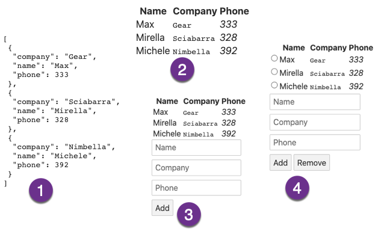

# **Lesson 6** @ Facile.it

Using Typescript with Nimbella

https://www.nimbella.com

---
# Plan

- Introducing Nimbella
- Sample: a "crud" back-end in javascript
- Adding types: migrating to typescript
- A front-end in Svelte/Typescript
  
---
# Nimbella vs Kubernetes vs Cloud


---


---


---


---
# A Nimbella project
- Collection of
  - actions (backend)
  - web assets (front-end)
  - redis (storage)
  - bucket (uploads)
  - more... 
- Managed with `nim`

---
# Conventions over configurations

- Actions are in `packages` folder
  - Subfolders are packages
  - Use "default" for "no package" actions
- A single file with extension determine the actions
  - It can also be a directory
- Deploy with `nim project deploy <project-dir>`

---
# Login

- `nim auth login`
open the browser and log into your github account

- `nim auth current`
show your namespace

- `nim namespace get`
show what you have in the namespace

- `nim namespace clean`
cleaning your namespace


---
# Simple Action
```js
function main(args) {
    let name = args.name || "world"
    console.log(name)
    return { body: "Hello, "+name }
}
```

---
# Create and Updating an Action

- `nim action create <name> <file>`
 - create an action with `<name>` using the `<file>`
 
- `nim action update <name> <file>`
   - works also if the action does not exists
   - some people only uses `update`


---
# Inspecting Actions

- `nim action list` 
list actions
- `nim action get <name>` 
get informations about an action
- `nim action get <name> --url` 
get the public url of an action

---
# <!--!--> Inspecting the action
```sh
# create
nim action list
nim action create hello src/hello.js
# Inspecting the action
nim action list
nim action get hello
nim action get hello --url 
```

---
# Action invocation with nim

##  with `action invoke`: 
- `nim action invoke <action-name> <parameters>`

## `<parameters>`:
- `-p <name> <value> ...`
can be repeated multiple times
- `-P <file>.json`
you need a file in json format

---
# <!--!--> Invoking an action with parameters
```sh
# Invoking an action with parameters
nim action invoke hello 
nim action invoke hello -p name Mike

# invoking an action with json
echo '{ "name": "Nimble"}' >args.json
nim action invoke hello -P args.json
```

---
# Action invocation with `curl` 

## only for web actions!

- `--web true`  
  - **not** all the actions are web public
  - *must* return a `body`

## use url-encoded parameters

- `curl -X GET <url>?event=hit`
- `curl -X POST -d  event=hit <url>`

---
# <!--!--> Using `curl` for web actions
```sh
# updating as a web action
nim action update hello src/hello.js --web=true

# Using Curl  for web actions
URL=$(nim action get hello --url)
echo $URL

# use GET and url parameters

curl "$URL?name=Mike"

## use POST and form data (url-encoded)
curl -X POST -d name=Mike "$URL"
```

---
# Checking Activations

- `nim activation list [--limit <n>]`
list actions, you can limit them

- `nim activation logs [<id>]`
show logs of an activation

- `nim activation result [<id>]`
show logs of an activation

---
# <!--!--> Activations
```sh
# Listing Activations
nim activation list --limit 3
date
nim action invoke hello -p name Rodric
nim activation list --limit 3

# Displaying logs and results
nim activation logs
nim activation result
```

---
# Using Redis

- A "in-memory" key-value store
- Data is persisted on disk and backed up
  - can be used as data store
- Very fast 
  - can be also used as cache
- Works as shared state
  - multiple actions can read and write

---
# <!--!--> Using `nim kv`
```sh
# nim kv support
nim kv
nim kv list
nim kv get hello
nim kv set hello world
nim kv list
nim kv get hello
nim kv clean
nim kv list
```

---
# <!--!--> Set in Redis
```js
// set.js
function main(args) {
    let db = require("@nimbella/sdk").redis()
    let key = "address:"+args.name
    let value = JSON.stringify({
            "name": args.name || "",
            "company":  args.company  || "",
            "phone": args.phone || ""
    })
    return db.setAsync(key, value)
    .then(reply => { return {"body": reply}})
    .catch(err =>  { return {"body": err}})
}
```

---
# <!--!--> Get in Redis
```js
// get.js
function main(args) {
    let db = require("@nimbella/sdk").redis()
    let key = "address:"+args.name
    return db.getAsync(key)
    .then(reply => { return JSON.parse(reply||"")})
    .catch(err =>  { return {"body": err}})
}
```

---
# <!--!--> `del.js`
```js
// del.js
function main(args) {
    let db = require("nim").redis()
    let key = "address:"+args.name
    return db.delAsync(key)
    .then(reply => { return {"body": reply}})
    .catch(err =>  { return {"body": err}})
}
```

---
# <!--!--> Deploy record actions
```sh
# Deploy fixed actions
mkdir -p address/packages/addr
cp src/set.js address/packages/addr/set.js
cp src/get.js address/packages/addr/get.js
cp src/del.js address/packages/addr/del.js
find address
nim project deploy address
```

---
# <!--!--> Test set/get/del
```sh
# Test the actions set/get/del
nim action invoke addr/set -p name Michele -p company Nimbella -p phone 392 
nim action invoke addr/get -p name Michele
nim action invoke addr/del -p name Michele
nim action invoke addr/get -p name Michele
```

---
# <!--!--> List all records
```js
// loading all the records
function main() {
    let db = require("@nimbella/sdk").redis()
    return db.keysAsync("address:*")
    .then(reply =>  
      reply.length == 0 ? [] : db.mgetAsync(reply))
    .then(reply => ({ 
        "body": reply.map(JSON.parse) 
      }))
    .catch(err => ({ "body": err}))
}
```

---
# Dissecting `all.js`:

- `db.keysAsync("address:*").then(reply => ...)`:
reply= `[ 'address:Mirella', 'address:Michele' ]`

- ` db.mgetAsync(reply).then(reply => ... )`:
reply = `[ '{"name":"Mirella","company":"Sciabarra","phone":328}',
'{"name":"Michele","company":"Nimbella","phone":392}' ]`

- `reply.map(['{}', '{"a":1}])` 
= `[{},{"a":1}]`

---
# <!--!--> Deploy and test `all.js`
```sh
# add all
cp src/all.js address/packages/addr/all.js
nim project deploy address
nim action invoke addr/all
nim action invoke addr/set -p name Michele -p company Nimbella -p phone 392 
nim action invoke addr/set -p name Mirella -p company Sciabarra -p phone 328 
nim action invoke addr/all
curl $(nim action get addr/all --url)
```

---
# Using TypeScript

- Different solutions:
  - integrated typescript compiler
  - deno runtime
  - **precompilation**

- Next Steps:
  - adding types to our code
  - compile typed code in untyped one
  - integrate compilation in the deployment

---
# <!--!--> hello.ts
```ts
// hello.ts
export function main(args: {name:string})
: {body:string} {
    let name: string = args.name || 'world'
    let greeting = 'Hello ' + name + '!'
    console.log(greeting)
    return { body: greeting }
}
```

---
# TypeScript: Folders and Files

- `address`: project  folder
  - `packages`: backend folder
    - `addr`: package folder
      - `hellots`: action folder
        - `src`: sources folder
           - `index.ts`: the typescript action
           - `packages.json`: configuration file
           - `tsconfig.ts`: compiler file
           - `.include`: list of included files

---
# <!--!--> Create a TypeScript action
```sh
## Create a TypeScript action
# prepare environment
mkdir -p address/packages/addr/hellots/src
cp src/hello.ts address/packages/addr/hellots/src/index.ts
# initializing 
cd address/packages/addr/hellots
npm -y init
tsc --init
# build
ls -la
tsc --outDir .
ls -la
echo "index.js" >.include
# deploy
cd ../../../..
nim project deploy address
nim action invoke addr/hellots
```

---
# Integrating with `nim`
- `nim` invokes automatically the build 
  - `npm run build` if exists `package.json`
- We need:
  - adding a build step `tsc` in `package.json`
  - configuring `tsc` in `tsconfig.json`

---
# `package.json`:
```js
{ 
 ...
 "scripts": {
    "build": "tsc" 
  },
  ...
}
```
- build command running the typescript compiler

---
# `tsconfig.js`:
```js
{
  "include": ["src/*.ts"],
  "exclude": [],
  "compilerOptions": {
    "outDir": "./",
    "target": "es2015",
    "module": "commonjs",
} }
```
- include and exclude folders
- set output directory to root of the action
- select target version and module system

---
# <!--!--> Testing the integration
```sh
# copying configuration and files
cp src/hi.ts address/packages/addr/hellots/src/index.ts
cp src/package.json address/packages/addr/hellots/package.json
cp src/tsconfig.json address/packages/addr/hellots/tsconfig.json
# test and deploy
nim project deploy address
nim action invoke addr/hellots
# expect `hi`
```

---
# From JavaScript to TypeScript

- adding types to the previous examples
   - declare types for used libraries
     - `decl.d.ts`
   - declare types for input and output
     - `index.d.ts`
  - use those types in code
     - `index.ts`

---
### `decls.d.ts`
```ts
export interface Record {
    name: string
    company: string
    phone: number
}
export interface Args extends Record {
    op?: string
}
export interface Result {
    data?: Record[]
    record?: Record
    status?: string
    error?: string
}
```

---
# Using Types
```ts
/// <reference path="index.d.ts" />
import { redis } from "@nimbella/sdk"

import type {Args, Result, Record} from './decl'

function main(args: Args): Promise<{body: Result}>
```
- type declarations for `@nimbella/sdk`
- define `Args`, `Result` and `Record`
- input and output types

---
## Declare module for `@nimbella.sdk`
```ts
// index.d.ts
declare module "@nimbella/sdk" {
    export function redis(): RedisClient;
    export interface RedisClient extends NodeJS.EventEmitter {
        setAsync(key:string, value:string): Promise<number>;
        getAsync(key:string): Promise<string>;
        delAsync(key:string): Promise<number>;
        keysAsync(pattern:string): Promise<Array<string>>;
        mgetAsync(keys:Array<string>): Promise<Array<string>>;
    }
}
```

---
# `index.ts` structure
```ts
/// <reference path="index.d.ts" />
import { redis } from "@nimbella/sdk"
import type {Args,Result,Record} from './decls'
```
```ts
export function main(args: Args): Promise<{body:Result}> {
    let db = redis()
    let key = "address:"+args.name
    switch (args.op) {
        // insert here
        // get/set/del/all
        default:
            return Promise.resolve({ body: { error: "unknown op" } })
    }
}
```

---
# `set`
```ts
case "set":
    delete args.op
    // save record
    return db.setAsync(key, 
           JSON.stringify(args))
        .then(reply => 
           ({ body: { status: reply.toString() } }))
        .catch(err => 
           ({ body: { error: err } }))
    break
```
- `Args extends Record` with `op?: string`

---
# `get` and `del`
```ts
  case 'get':
      return db.getAsync(key)
          .then(reply => 
             ({ body: { record: JSON.parse(reply) } }))
          .catch(err => ({ body: { error: err } }))
      break
```
```ts
  case 'del':
      return db.delAsync(key)
          .then(reply => 
             ({ body: { status: reply.toString() } }))
          .catch(err => ({ body: { error: err } }))
      break
```

---
## `all`
```ts
case 'all':
    return db.keysAsync("address:*")
        .then(reply =>  
         reply.length == 0 
          ? [] as string[]   
          : db.mgetAsync(reply))
        .then(reply => ({body: { data: 
              reply.map(JSON.parse as (x:string)=> Record) }
         }))
        .catch(err => ({ body: { error: err } }))
```
- `[] as string[]` 
- `JSON.parse as (x:string)=> Record`

---
# <!--!--> Deploying crud
```sh
## Deploying Crud
# prepare crud typescript
mkdir -p address/packages/addr/crud/src
cp src/package.json  address/packages/addr/crud/package.json
cp src/tsconfig.json address/packages/addr/crud/tsconfig.json
cp src/decl.d.ts      address/packages/addr/crud/src/decl.d.ts
cp src/index.d.ts     address/packages/addr/crud/src/index.d.ts
cp src/index.ts       address/packages/addr/crud/src/index.ts
echo "index.js"     > address/packages/addr/crud/.include

# deploy
find address/packages/addr/crud
nim project deploy address
ls -la address/packages/addr/crud
# note the index.js has been generated
```

---
# <!--!--> Testing crud
```sh
nim kv clean
nim action invoke addr/crud -p op all
nim action invoke addr/crud -p op set -p name Michele -p company Nimbella -p phone 392
nim action invoke addr/crud -p op get -p name Michele
nim action invoke addr/crud -p op set -p name Mirella -p company Butterfly -p phone 328
nim action invoke addr/crud -p op all
nim action invoke addr/crud -p op del -p name Michele
nim action invoke addr/crud -p op all
```

---


---
# Create a svelte app

- `npx degit sveltejs/template web`
it uses a template on GitHub
- requires some configuration:
  - `project.yml`
  - `web/.include`

---
# <!--!--> Setup Svelte
```sh
# setup svelte
cd address
# create a template
npx degit sveltejs/template web
# strip one level
echo -e "bucket:\n  strip: 1" >project.yml
cd web
# enable typescript
node scripts/setupTypeScript.js 
# include public
echo "public" >.include
cd ../..
nim project deploy address
```

---
# How to use a subfolder

- `project.yml` (strip one level):
```
bucket:
  strip: 1
```

- `web/.include` (pick the subfolder `public`):
```
public
```

---
# Svelte is "reactive"
- declare: `let data: Record[] = []`
- assign: `data = []` 
  - triggering update view
    - templates are re-evaluated
- `onMount` executed when view ready

---
## <!--!--> Load all data
```sh
<script lang="ts">
  import type {Record, Result, Args} from './decl'

  let data: Record[] = []

  function all()  {
      fetch("/api/addr/crud?op=all")
      .then(r => r.json() as Result)
      .then(d => data = d.data ? d.data : [])
  }
  // init
  import { onMount } from 'svelte'
  onMount(all)
</script>
```

---
# Svelte templates
  - Reactive:
    - just update variables to re-evaluate
  - `{#each data as row}`
    - iterates array assigning elements to `row`
    - `{row.name}`
      - renders value
  - `{/each}`
    - closes block

---
# <!--!--> Adding the table
```html
<table>
  <tr>
    <th>Name</th>
    <th>Company</th>
    <th>Phone</th>
  </tr>
  {#each data as row}
      <tr>
        <td>{row.name}</td>
        <td><tt>{row.company}</tt></td>
        <td><i>{row.phone}</i></td>
      </tr>
  {/each}
</table>
```

---
# <!--!--> Deploy
```sh
cp src/decl.d.ts address/web/src/decl.d.ts
cp src/App1.svelte address/web/src/App.svelte
nim project deploy address
```

---
# <!--!--> Form
```ts
let form = <Record>{};

function add() {
    let args: Args = form
    args.op = "set"
    fetch("/api/addr/set", {
      method: "POST",
      headers: { "Content-Type": "application/json" },
      body: JSON.stringify(args),
    }).then(all);
}
```

---
# Svelte Bindings
 - `<input bind:value={form.name}>`
   - value stored into `form.name`

# Svelte events

 - `<button on:click={add}>Add</button>`
   - event `click` execute function `add`
  

---
# <!--!--> Form HTML
```html
<form>
  <input placeholder="Name" 
   bind:value={form.name}>
  <br>
  <input placeholder="Company" 
   bind:value={form.company}>
  <br>
  <input placeholder="Phone" 
   bind:value={form.phone}>
  <br>
</form>
<button on:click={add}>Add</button>
```

---
# <!--!--> Deploy v3
```sh
# deploy v3
cp src/App2.svelte address/web/src/App.svelte
nim project deploy address
```

---
# <!--!--> Remove
```ts
  let select: string;
  function remove() {
    fetch("/api/addr/crud?op=del&name=" + select)
    .then(all);
  }
```

---
## Remove (changes)
```html
 <table>
    <tr>
+     <th></th>
      <th>Name</th>
...
      <tr>
+       <td>
+         <input type="radio" 
+          bind:group={select} 
+          value={row.name} />
+       </td>
        <td>{row.name}</td>
...
  <button on:click={add}>Add</button>
+ <button on:click={remove}>Remove</button>
```

---
# <!--!--> Final
```sh
# deploy v4
cp src/App3.svelte address/web/src/App.svelte
nim project deploy address
```


